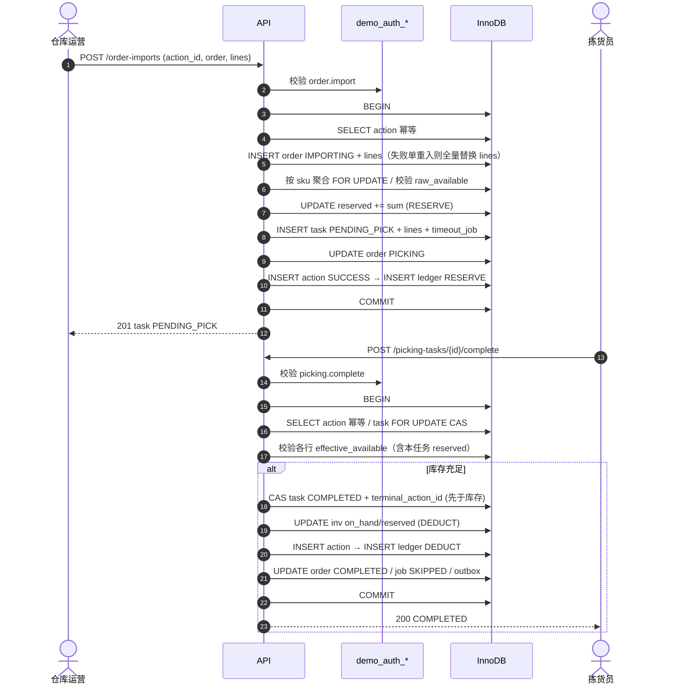
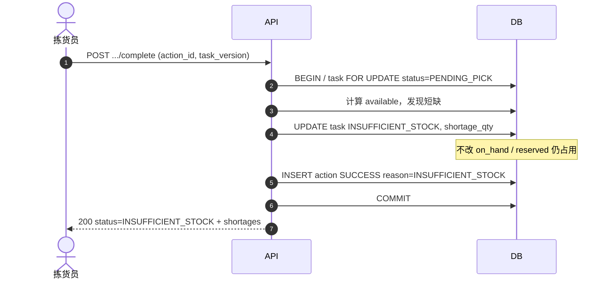
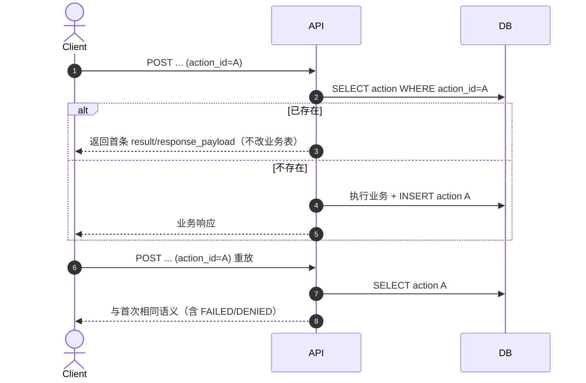
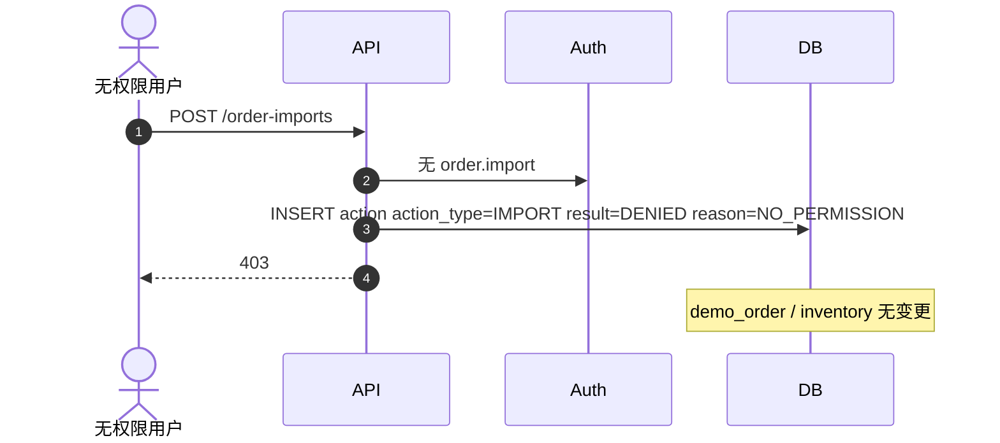
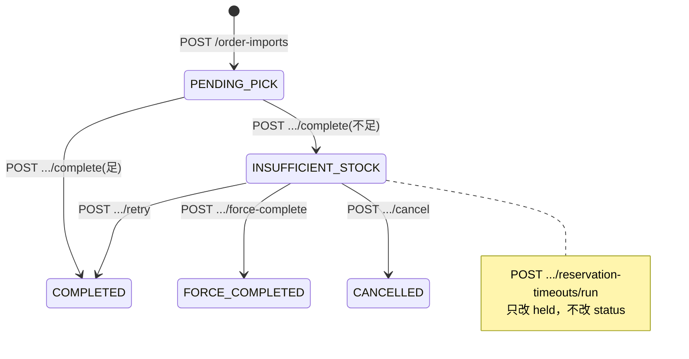

# 接口与关键业务流程设计

> Source of Truth：`docs/sql/001_schema_picking_inventory.sql`  
> 需求：`docs/order-picking-inventory-split-reviewed.md` · PRD：`docs/PRD-订单出库拣货扣减.md`（v1.1）  
> 库设计：`docs/db-design-picking-inventory.md`  
> **本稿不改表结构**；协议/写序/判定公式已与审查定稿对齐；字段缺口见文末「缺口表」。

---

## 0. 约定

| 项 | 约定 |
|----|------|
| Base URL | `/api/v1` |
| 鉴权 | Header `X-User-Id: {demo_auth_user.id}`（Demo）；查 `demo_auth_user_role`→`role_permission`→`permission.code` |
| 幂等 | Header `Idempotency-Key` **或** Body `action_id`（二者取一，优先 Header）；写入 `picking_task_action.action_id` |
| 追踪 | 可选 Header `X-Request-Id` → `picking_task_action.request_id` |
| 数量/ID | 与表一致：`DECIMAL` 用字符串或 number；ID 为 `uint64` |
| 成功态写 `terminal_action_id` | 仅 `COMPLETED` / `FORCE_COMPLETED` / `CANCELLED` |
| 超时 actor | 固定 `demo_auth_user.id=1`（`system`） |
| 写操作审计字段 | `actor_id`、`warehouse_id` 必填；能关联时写 `order_id`/`task_id` |
| 库存充足判定 | 见下方「库存判定」；同 SKU 多行必须按 `sku_id` 聚合后再锁行/改余额 |

### 库存判定（定稿）

```
raw_available     = on_hand - reserved - locked
own_reserved(sku) = 本任务对该 SKU 仍占用的预留合计（held=1 时通常 = demand 聚合量；held=0 时 = 0）
effective_available = on_hand - locked - (reserved - own_reserved)
                    = raw_available + own_reserved
```

| 场景 | 使用公式 | 说明 |
|------|----------|------|
| 导入预留 / held=0 再预留 | `raw_available ≥ demand` | 尚不占用或已释放本任务预留 |
| 完成 / held=1 重试扣减 | `effective_available ≥ demand` | 必须计入本任务已预留，避免主路径误判不足 |
| 平替扣减平替 SKU | `raw_available(substitute) ≥ substitute_qty` | 平替 SKU 无本任务预留 |

缺 `inventory_balance` 行 → `422 INVENTORY_NOT_FOUND`（不静默 upsert）。

### 通用幂等算法（所有写接口）

```
BEGIN
  SELECT * FROM picking_task_action WHERE action_id = ?;
  IF found THEN 原样返回首条对应 HTTP 语义; ROLLBACK/COMMIT 空事务; END

  鉴权；若无权限:
    INSERT picking_task_action(
      action_type=<意图动作 IMPORT|COMPLETE|...>,  -- 禁止写 DENY 类型
      result=DENIED, reason_code=NO_PERMISSION,
      actor_id=?, warehouse_id=? ...);
    COMMIT; return 403;

  -- 业务写序（防双扣 + 满足 ledger→action FK）：
  -- 1) 终态：先 CAS picking_task（含 terminal_action_id）
  -- 2) 改 inventory_balance（按 sku_id 聚合，ORDER BY sku_id FOR UPDATE）
  -- 3) INSERT picking_task_action → 取 action.id
  -- 4) INSERT inventory_ledger(task_action_id=action.id)（若有库存变动）
  -- 5) 更新 order / timeout_job / outbox
  -- 若步骤 3 撞 action_id UK：ROLLBACK 本事务，再 SELECT 首条返回（并发幂等）
COMMIT
```

**约定：** `action_type` 始终表示**意图动作**；拒绝用 `result=DENIED`。Schema 中 `DENY` 枚举仅兼容保留，新代码勿写入。

---

## 1. 接口清单

| # | 方法 | 路径 | 权限码 | 说明 |
|---|------|------|--------|------|
| 1 | POST | `/api/v1/order-imports` | `order.import` | 导入订单→预留→待拣货 |
| 2 | GET | `/api/v1/picking-tasks` | `picking.view` | 任务列表 |
| 3 | GET | `/api/v1/picking-tasks/{task_id}` | `picking.view` | 任务详情 |
| 4 | POST | `/api/v1/picking-tasks/{task_id}/complete` | `picking.complete` | 完成拣货（足→完成；不足→异常） |
| 5 | POST | `/api/v1/picking-tasks/{task_id}/retry` | `picking.complete` | 异常到货重试 |
| 6 | POST | `/api/v1/picking-tasks/{task_id}/force-complete` | `picking.force_complete` | 平替强制完成 |
| 7 | POST | `/api/v1/picking-tasks/{task_id}/cancel` | `picking.cancel` | 取消任务+订单 |
| 8 | POST | `/api/v1/internal/reservation-timeouts/run` | （内部/定时，actor=system） | 扫描并释预留 |

---

## 2. 各接口：请求 / 响应 / 表操作 / 状态变迁

### 2.1 `POST /api/v1/order-imports`

**权限：** `order.import`

**Request**
```json
{
  "action_id": "uuid",
  "external_order_no": "SO-20260721-001",
  "warehouse_id": 1,
  "lines": [
    { "line_no": 1, "sku_id": 10, "qty": "2.0000" }
  ]
}
```

**Response 201（首次成功）**
```json
{
  "action_id": "uuid",
  "result": "SUCCESS",
  "order": { "id": 100, "external_order_no": "SO-20260721-001", "warehouse_id": 1, "status": "PICKING" },
  "task": { "id": 200, "status": "PENDING_PICK", "version": 0, "reservation_held": true, "reservation_expire_at": "..." }
}
```

**Response 200（业务键或 action_id 幂等命中）** — 返回已有 order/task 或首条 action 快照  

**Response 403** — `result=DENIED`  
**Response 409/422** — 库存不足等：`result=FAILED`, `reason_code=INSUFFICIENT_STOCK`, `shortages:[{sku_id, demand_qty, available, shortage_qty}]`

#### 状态变迁
| 对象 | From | To |
|------|------|-----|
| `demo_order` | （无）→`IMPORTING`→ | 成功 `PICKING`；失败 →`IMPORT_FAILED`（必落库+写 FAILED 日志） |
| `picking_task` | — | 成功 `PENDING_PICK` |

已存在 `PICKING`+task：直接幂等返回，不改库存。  
已存在 `IMPORT_FAILED`：允许同键重入；**以本次请求 `lines` 全量替换** `demo_order_line`（先删后插），再走校验→成功预留或再次 `IMPORT_FAILED`；成功前不得已有 task/预留。

**失败落库（禁止静默全回滚）：** 库存不足 / 主数据校验失败 / `INVENTORY_NOT_FOUND` 等业务失败必须同事务：`demo_order.status=IMPORT_FAILED`（无 task、无预留）+ `picking_task_action.result=FAILED` 后 `COMMIT`。仅「幂等命中已有成功单」走短路径返回；鉴权拒绝走 `DENIED` 并 COMMIT。避免 `ROLLBACK` 导致失败审计丢失（对齐 PRD §5.6 / §7）。

#### 表操作（成功路径，同事务）
| 表 | 操作 |
|----|------|
| `picking_task_action` | SELECT by action_id；库存变更后、ledger 前 INSERT SUCCESS（取 id） |
| `demo_auth_*` | SELECT 鉴权 |
| `ref_warehouse` / `ref_sku` | SELECT 校验存在且启用 |
| `demo_order` | SELECT by UK；无则 INSERT `IMPORTING`；业务失败则 UPDATE `IMPORT_FAILED`（必落库） |
| `demo_order_line` | 新单 INSERT；`IMPORT_FAILED` 重入则 DELETE+INSERT 全量替换 |
| `inventory_balance` | 按 `sku_id` **聚合** demand → `ORDER BY sku_id` → `SELECT … FOR UPDATE`；校验 `raw_available≥sum`；缺行 → `INVENTORY_NOT_FOUND`；`UPDATE reserved+=sum, version=version+1` |
| `picking_task` | INSERT `PENDING_PICK`, `reservation_held=1`, `reservation_expire_at=now+24h` |
| `picking_task_line` | INSERT 行（可按原始 line_no 保留多行同 SKU） |
| `inventory_ledger` | INSERT `biz_type=RESERVE`，`task_action_id=action.id`（按聚合 SKU 或按行均可，须关联 action） |
| `reservation_timeout_job` | INSERT `expire_at=now+24h`, `status=PENDING`（扫描仍只处理异常态+held） |
| `demo_order` | UPDATE `status=PICKING` |

---

### 2.2 `GET /api/v1/picking-tasks`

**权限：** `picking.view`  
**Query：** `status`, `warehouse_id`, `external_order_no`, `page`, `page_size`

**Response 200**
```json
{
  "items": [
    {
      "id": 200,
      "order_id": 100,
      "external_order_no": "SO-...",
      "warehouse_id": 1,
      "status": "PENDING_PICK",
      "version": 0,
      "reservation_held": true,
      "reservation_expire_at": "...",
      "exception_code": null,
      "created_at": "..."
    }
  ],
  "total": 1
}
```

#### 表操作
| 表 | 操作 |
|----|------|
| `demo_auth_*` | SELECT 鉴权 |
| `picking_task` | SELECT … WHERE 过滤 ORDER BY created_at DESC |

无状态变迁。

---

### 2.3 `GET /api/v1/picking-tasks/{task_id}`

**权限：** `picking.view`

**Response** 含 task + lines（`demand_qty`,`shortage_qty`,`substitute_*`,`line_fulfill_type`）+ 订单 status。

#### 表操作
| 表 | 操作 |
|----|------|
| `picking_task` | SELECT |
| `picking_task_line` | SELECT by task_id |
| `demo_order` | SELECT by order_id |

---

### 2.4 `POST /api/v1/picking-tasks/{task_id}/complete`

**权限：** `picking.complete`  
覆盖：**主路径完成** + **库存不足进异常**。

**Request**
```json
{ "action_id": "uuid", "task_version": 0 }
```
`task_version` = 客户端读到的 `picking_task.version`（CAS）。

**Response 200 完成**
```json
{
  "result": "SUCCESS",
  "reason_code": null,
  "task": { "id": 200, "status": "COMPLETED", "version": 1, "reservation_held": false }
}
```

**Response 200 不足（业务成功进入异常）**
```json
{
  "result": "SUCCESS",
  "reason_code": "INSUFFICIENT_STOCK",
  "task": { "id": 200, "status": "INSUFFICIENT_STOCK", "version": 1, "reservation_held": true },
  "shortages": [{ "sku_id": 10, "demand_qty": "2.0000", "available": "0.5000", "shortage_qty": "1.5000" }]
}
```

**Response 409** — version/状态冲突 `TASK_VERSION_CONFLICT`  
**Response 403** — DENIED

#### 状态变迁
| 结果 | task | order | reservation | job |
|------|------|-------|-------------|-----|
| 足 | `PENDING_PICK`→`COMPLETED` | `PICKING`→`COMPLETED` | held false, reason COMPLETE | `SKIPPED` |
| 不足 | `PENDING_PICK`→`INSUFFICIENT_STOCK` | 保持 `PICKING` | held 仍 true | 保持 `PENDING` |

#### 表操作（足，同事务）
**顺序不变量（防双扣 + FK）：** 先 CAS 终态 → 改 balance → **INSERT action 取 id** → **INSERT ledger(task_action_id)** → order/job/outbox。禁止先写 ledger 再写 action。并断言 `reservation_held=1`（本期超时不释 `PENDING_PICK` 预留；若 held=0 → `409 RESERVATION_NOT_HELD`）。

**充足判定：** 按 `sku_id` 聚合后用 `effective_available ≥ demand`（见 §0）。

| 表 | 操作 |
|----|------|
| `picking_task` | SELECT FOR UPDATE；**先** `UPDATE status=COMPLETED, version=version+1, terminal_action_id=?, reservation_held=0, reservation_released_at=now, reservation_release_reason='COMPLETE', completed_at=now WHERE id=? AND status='PENDING_PICK' AND version=? AND reservation_held=1`；rows=0 → 409，**不得**改库存 |
| `picking_task_line` | SELECT；按 `sku_id` 聚合 demand |
| `inventory_balance` | 按 `sku_id` 排序 FOR UPDATE；`on_hand-=demand, reserved-=demand, version++`（校验 CAS） |
| `picking_task_action` | INSERT SUCCESS（取 id） |
| `inventory_ledger` | INSERT `DEDUCT`（`task_action_id=action.id`；约定：`delta_on_hand=-q, delta_reserved=-q`） |
| `demo_order` | UPDATE `COMPLETED` |
| `reservation_timeout_job` | UPDATE `SKIPPED` |
| `integration_outbox` | INSERT `TASK_COMPLETED` / `ORDER_STATUS_SYNC` |

#### 表操作（不足，同事务）
| 表 | 操作 |
|----|------|
| `picking_task` | UPDATE `INSUFFICIENT_STOCK`, version+1, `exception_code='INSUFFICIENT_STOCK'`, message；**不改** held |
| `picking_task_line` | UPDATE `shortage_qty` |
| `inventory_balance` | **不 UPDATE** |
| `picking_task_action` | INSERT SUCCESS + reason_code=INSUFFICIENT_STOCK（无 ledger） |
| `demo_order` / job / ledger | **不改** |

---

### 2.5 `POST /api/v1/picking-tasks/{task_id}/retry`

**权限：** `picking.complete`

**Request**
```json
{ "action_id": "uuid", "task_version": 1 }
```

#### 状态变迁
| 条件 | task | 库存 |
|------|------|------|
| held=true 且 `effective_available` 足 | →`COMPLETED` | DEDUCT+释预留 |
| held=false 且 `raw_available` 足 | →`COMPLETED` | 先 `RE_RESERVE` 再 DEDUCT+释预留；成功后 job=`SKIPPED`（不必刷 expire） |
| 仍不足 | 保持 `INSUFFICIENT_STOCK` | **不改库存**（含不 RE_RESERVE）；更新 shortage |

订单：成功→`COMPLETED`。

#### 表操作（held=false 成功）
| 表 | 操作 |
|----|------|
| `picking_task` | **先** CAS：`INSUFFICIENT_STOCK`→`COMPLETED` + terminal_action_id（库存变更前）；held 随完成置 0 |
| `inventory_balance` | 按 sku 聚合；RE_RESERVE：`reserved+=q`；再 DEDUCT：`on_hand-=q, reserved-=q`（同事务；中间失败整单回滚） |
| `picking_task_action` | INSERT SUCCESS（取 id） |
| `inventory_ledger` | INSERT `RE_RESERVE`；INSERT `DEDUCT`（均带 `task_action_id`） |
| `reservation_timeout_job` | 成功完成后 `SKIPPED` |
| `demo_order` | `COMPLETED` |
| `integration_outbox` | `TASK_COMPLETED` |

**说明：** `RE_RESERVE`+`DEDUCT` 必须同事务。本期 retry **要么终态成功，要么不足且不改库存**；不存在「只预留不完成」半成功。held=true 成功路径同 complete：用 `effective_available`，写序同 §0。

---

### 2.6 `POST /api/v1/picking-tasks/{task_id}/force-complete`

**权限：** `picking.force_complete`

**Request**
```json
{
  "action_id": "uuid",
  "task_version": 1,
  "lines": [
    { "line_no": 1, "substitute_sku_id": 99, "substitute_qty": "2.0000" }
  ]
}
```

#### 状态变迁
| 对象 | 变迁 |
|------|------|
| task | `INSUFFICIENT_STOCK`→`FORCE_COMPLETED` |
| order | →`FORCE_COMPLETED` |
| 原 SKU | **仅当 `reservation_held=1`** 时 RELEASE reserved（不扣 on_hand）；held=0 则跳过释放 |
| 平替 SKU | `on_hand-=substitute_qty`（`DEDUCT_SUBSTITUTE`） |
| line | 写 `substitute_*`, `line_fulfill_type='SUBSTITUTE'` |
| job | `SKIPPED` |

**行覆盖：** `lines` 必须覆盖任务全部行（按 `line_no`）；缺行 → `422 LINES_INCOMPLETE`。本期强制 `substitute_qty = demand_qty`（全量平替）；否则 `422 QTY_MISMATCH`。若将来支持部分数量，另开版本字段。

平替 SKU 无余额行 → `422 INVENTORY_NOT_FOUND`；`raw_available(substitute) < substitute_qty` → `422 INSUFFICIENT_STOCK`。

#### 表操作
| 表 | 操作 |
|----|------|
| `picking_task` / `line` | **先** CAS：`INSUFFICIENT_STOCK`→`FORCE_COMPLETED` + `terminal_action_id` + held/release 字段；再写平替行字段 |
| `inventory_balance` | 若 held：原 SKU `reserved-=demand`；平替：校验 `raw_available` 后 `on_hand-=sub_qty`（按 sku 排序加锁） |
| `picking_task_action` | INSERT SUCCESS（取 id） |
| `inventory_ledger` | 条件 `RELEASE` + `DEDUCT_SUBSTITUTE`（带 `task_action_id`） |
| `demo_order` | `FORCE_COMPLETED` |
| `reservation_timeout_job` | `SKIPPED` |
| `integration_outbox` | `TASK_FORCE_COMPLETED` |

---

### 2.7 `POST /api/v1/picking-tasks/{task_id}/cancel`

**权限：** `picking.cancel`

**Request**
```json
{ "action_id": "uuid", "task_version": 1, "cancel_reason": "客户取消" }
```

#### 状态变迁
| 对象 | 变迁 |
|------|------|
| task | `INSUFFICIENT_STOCK`→`CANCELLED` |
| order | →`CANCELLED`（写 `cancelled_at`,`cancel_reason`） |
| 库存 | 若 held：RELEASE reserved |
| job | `SKIPPED` |

#### 表操作
| 表 | 操作 |
|----|------|
| `picking_task` | **先** CAS + terminal_action_id + held/release 字段；rows=0 → 409 |
| `inventory_balance` / 准备 ledger | **仅当更新前 held=1**：RELEASE（按 sku 聚合） |
| `picking_task_action` | INSERT SUCCESS（取 id） |
| `inventory_ledger` | 若有 RELEASE：带 `task_action_id` |
| `demo_order` | UPDATE CANCELLED |
| `reservation_timeout_job` | SKIPPED |
| `integration_outbox` | `ORDER_CANCEL` |

---

### 2.8 `POST /api/v1/internal/reservation-timeouts/run`

**权限：** 内部调用；强制 `actor_id=1`（system）。可无用户权限码，或部署级保护。

**Request**
```json
{ "limit": 100 }
```

**逻辑：**  
`SELECT j.* FROM reservation_timeout_job j
 JOIN picking_task t ON t.id = j.task_id
 WHERE j.status='PENDING' AND j.expire_at<=NOW(3)
   AND t.status='INSUFFICIENT_STOCK' AND t.reservation_held=1
 ORDER BY j.expire_at LIMIT ? FOR UPDATE SKIP LOCKED`（或逐条事务）。

对每条 job：
1. SELECT task FOR UPDATE  
2. 若 task 已是终态 → job=`SKIPPED`  
3. 若 `reservation_held=0` → job=`DONE`（幂等）  
4. 若 `status <> 'INSUFFICIENT_STOCK'` → job=`SKIPPED`（**本期不释 `PENDING_PICK` 预留**，避免无收口路径）  
5. 否则 RELEASE 各行 reserved；task：`held=0`, `reservation_released_at=now`, `reason=TIMEOUT`；**status 不变** `INSUFFICIENT_STOCK`  
6. ledger `RELEASE`；先 INSERT action `TIMEOUT_RELEASE`（action_id=`timeout:{job_id}:{expire_at}`）再 INSERT ledger（`task_action_id`）  
7. job=`DONE`

**范围（定稿）：** 仅 `task.status='INSUFFICIENT_STOCK' AND reservation_held=1`。超时后仍走 `retry` / `force-complete` / `cancel`（retry 含 `held=false`→`RE_RESERVE`）。

---

## 3. Mermaid 时序图（按场景）

### 3.1 主路径：导入成功 → 完成扣减



### 3.2 库存不足：完成 → INSUFFICIENT_STOCK



### 3.3 幂等：同 action_id 重放



### 3.4 权限拒绝



### 3.5 异常闭环：超时释预留 → 重试 / 平替 / 取消

```mermaid
sequenceDiagram
  autonumber
  participant Cron as 定时器
  participant API
  participant DB
  actor Sup as 主管

  Cron->>API: POST /internal/reservation-timeouts/run
  API->>DB: 扫 job PENDING AND expire_at<=now AND task=INSUFFICIENT_STOCK+held
  API->>DB: RELEASE reserved; task held=false reason=TIMEOUT
  Note over DB: status 仍 INSUFFICIENT_STOCK；不处理 PENDING_PICK
  API->>DB: action TIMEOUT_RELEASE (actor=system) / job DONE

  alt 到货重试
    Sup->>API: POST .../retry
    API->>DB: RE_RESERVE? + DEDUCT → COMPLETED
  else 平替强制完成
    Sup->>API: POST .../force-complete (substitute lines)
    API->>DB: RELEASE 原SKU + DEDUCT_SUBSTITUTE → FORCE_COMPLETED
  else 取消
    Sup->>API: POST .../cancel
    API->>DB: 条件 RELEASE → CANCELLED + outbox ORDER_CANCEL
  end
```

---

## 4. 状态机总览（接口视角）



---

## 5. 缺口表（接口字段 vs 表 —— 不改表前提下的处理）

| 缺口 | 接口侧需要 | 表现状 | 处理（不改表） |
|------|------------|--------|----------------|
| G1 | 用 `warehouse_code` / `sku_code` 导入更友好 | 表仅 `warehouse_id` / `sku_id` | 接口可同时收 code：先查 `ref_warehouse.code` / `ref_sku.sku_code` 解析为 id 再落库；**响应仍回 id** |
| G2 | 需求审计 `entity_type` | 无此列 | 用 `task_id`+`order_id`+`action_type` 表达；写入 `request_payload` |
| G3 | 列表要展示 SKU 名称 | 行表无 name | JOIN `ref_sku` 只读 |
| G4 | `available` 字段 | 不落库 | 响应内计算 `on_hand - reserved - locked` |
| G5 | 完成「纯失败」与「成功进异常」 | 皆可走 action.result | HTTP 200 + `reason_code=INSUFFICIENT_STOCK` 表示进异常；真正系统错误用 5xx/FAILED |
| G6 | 导入中断半成品 | 有 `IMPORTING` | 可选内部任务：僵死 `IMPORTING`→`IMPORT_FAILED`+FAILED action（不改表） |
| G7 | Outbox 消费更新订单 | 已有 outbox + demo_order | Demo 可同步写 order，outbox 作展示；或异步消费者 UPDATE——**不改表** |
| G8 | `task_version` 请求字段 | 列名是 `version` | 请求 JSON 用 `task_version`，SQL 写 `picking_task.version` |
| G9 | 登录 Token | 无 session 表 | Demo 用 `X-User-Id`；生产换账号中心 JWT——**不改表** |

**已拍板（原 G10）：** 超时**仅**处理 `INSUFFICIENT_STOCK`+held；`PENDING_PICK` 到期不释预留（job 可 SKIPPED 或等人工完成）。扩展「待拣也超时」时须同步开放 complete 的 `RE_RESERVE` 或超时转入异常态——单独立项，本期不做。

**已拍板（审查定稿）：**  
- 充足判定区分 `raw_available` / `effective_available`（§0）  
- 写序：CAS → balance → action → ledger（满足 FK）  
- `IMPORT_FAILED` 重入全量替换 lines  
- 拒绝：`action_type`=意图 + `result=DENIED`  
- 平替：`substitute_qty=demand_qty`；缺余额行 `INVENTORY_NOT_FOUND`  

**结论：** 上述缺口均可在应用层消化；与状态机闭环一致，**无需为闭环改表结构**（仅注释/协议对齐）。

---

## 6. 错误码（建议）

| reason_code | HTTP | 含义 |
|-------------|------|------|
| `NO_PERMISSION` | 403 | 权限拒绝 |
| `IDEMPOTENT_HIT` | 200 | 幂等命中（可在 payload 标记） |
| `INSUFFICIENT_STOCK` | 200 或 422 | 完成进异常用 200；导入/平替失败用 422 |
| `INVENTORY_NOT_FOUND` | 422 | 对应仓+SKU 无库存余额行 |
| `TASK_VERSION_CONFLICT` | 409 | CAS 失败 |
| `INVALID_STATUS` | 409 | 当前状态不允许该动作 |
| `RESERVATION_NOT_HELD` | 409 | complete 时 held=0（本期防御码） |
| `LINES_INCOMPLETE` | 422 | 平替未覆盖全部任务行 |
| `QTY_MISMATCH` | 422 | 平替数量 ≠ demand_qty（本期） |
| `NOT_FOUND` | 404 | 任务不存在 |

---

## 7. 实现顺序建议

1. 鉴权中间件 + 幂等工具方法（含 DENIED 写日志）  
2. `POST /order-imports`（失败必落 `IMPORT_FAILED`）+ `GET` 列表/详情  
3. `POST .../complete`（**先 CAS 再扣减**；足 / 不足两分支）  
4. `retry` / `force-complete`（条件 RELEASE + 行全覆盖）/ `cancel`  
5. `reservation-timeouts/run`（**仅** `INSUFFICIENT_STOCK`+held）+ 定时触发  
