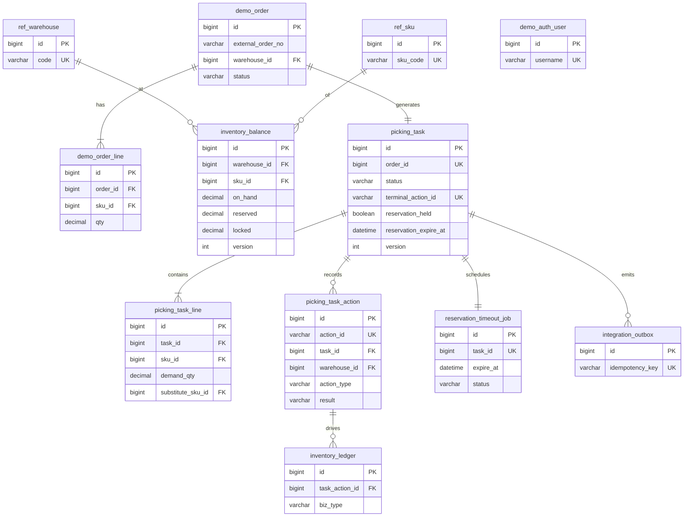
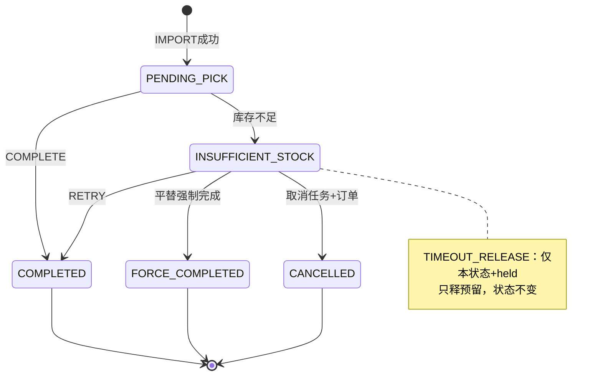

# 数据库设计：订单出库拣货扣减（定稿）

> 配套 DDL：[`sql/001_schema_picking_inventory.sql`](./sql/001_schema_picking_inventory.sql)  
> 需求：[`order-picking-inventory-split-reviewed.md`](./order-picking-inventory-split-reviewed.md)

## 拍板结论

| 项 | 结论 |
|----|------|
| 任务状态 | `PENDING_PICK` / `INSUFFICIENT_STOCK` / `COMPLETED` / `FORCE_COMPLETED` / `CANCELLED`（第五态正式） |
| 订单状态 | `IMPORTING` / `IMPORT_FAILED` / `PICKING` / `COMPLETED` / `FORCE_COMPLETED` / `CANCELLED` |
| 导入 | **同事务**落到 `PICKING`+task+预留；失败 → `IMPORT_FAILED`（可恢复） |
| 幂等 | `action_id` UK；**同键重放返回首条**（含 FAILED/DENIED） |
| 双扣防线 | `picking_task.terminal_action_id` UNIQUE + `version` CAS（不做 ledger 部分唯一） |
| 超时扫描 | 以 **`reservation_timeout_job.expire_at`** 为准；**仅** `INSUFFICIENT_STOCK`+held；`task.reservation_expire_at` **双写同步**；`PENDING_PICK` 本期不释预留 |
| 超时后重试 | 足：先 `RE_RESERVE` 再扣减，成功则 job=`SKIPPED`；不足：不改库存 |
| 平替 | 条件释原 SKU 预留（held 才 RELEASE），扣平替 `on_hand`；请求行须全覆盖且 `substitute_qty=demand_qty` |
| 导入失败 | 必落 `IMPORT_FAILED` + `action.FAILED`（禁止静默 ROLLBACK 丢审计）；同键重入全量替换 lines |
| 终态写库序 | **先** CAS `picking_task`（含 `terminal_action_id`）→ 改 `inventory_balance` → **INSERT action 取 id** → **INSERT ledger(task_action_id)** → order/job/outbox |
| 库存充足 | 导入/`RE_RESERVE` 用 `raw_available`；完成/held=1 重试用 `effective_available=raw_available+own_reserved` |
| Demo FK | 强制挂 `ref_*` / `demo_order` / `demo_auth_user`，`ON DELETE RESTRICT`；生产可摘 ref/auth |
| 系统用户 | `demo_auth_user.username=system`（id=1），TIMEOUT 使用 |
| 拒绝审计 | `action_type`=意图动作 + `result=DENIED`；`DENY` 类型仅 Schema 兼容保留 |

## 预留生命周期

```
IMPORT 同事务成功
  → order=PICKING, task=PENDING_PICK
  → reserved↑, held=true
  → timeout_job.expire_at = now+24h（同步写 task.reservation_expire_at）

COMPLETE 成功（库存足）
  → 先 CAS task→COMPLETED+terminal_action_id（held 须为 1；校验 effective_available）
  → 再 DEDUCT（on_hand/reserved）→ INSERT action → ledger → job=SKIPPED

完成时不足
  → 不扣 on_hand，held 仍 true → INSUFFICIENT_STOCK

TIMEOUT（扫 job.expire_at；**仅** status=INSUFFICIENT_STOCK 且 held=true）
  → 仅 RELEASE reserved，held=false，status 仍 INSUFFICIENT_STOCK
  → job=DONE
  → 之后：RETRY / FORCE_COMPLETE / CANCEL（FORCE/CANCEL：held=false 时跳过 RELEASE）

RETRY(held=true)  → 校验 effective_available；足则 DEDUCT+释预留 → COMPLETED
RETRY(held=false) → 校验 raw_available；足则 RE_RESERVE→DEDUCT→COMPLETED，job=SKIPPED；不足则不改库存
FORCE_COMPLETE    → 条件释原预留 + DEDUCT_SUBSTITUTE → FORCE_COMPLETED（lines 全覆盖且 qty=demand）
CANCEL            → 若 held 则释预留 → CANCELLED + order CANCELLED
终态              → job 若仍 PENDING 则 SKIPPED，禁止再 RELEASE
导入失败          → order=IMPORT_FAILED + action FAILED（禁止静默全回滚丢审计）
IMPORT_FAILED重入 → 全量替换 order_line 后再校验
```

## 幂等协议

1. 客户端每次请求带 `action_id`。  
2. 插入 `picking_task_action`；若 UK 冲突 → `SELECT` 该 `action_id` **首条**原样返回（含 FAILED/DENIED）。  
3. **禁止**把 UK 冲突解释为「新的成功」。  
4. 导入另有业务幂等键：`UK(external_order_no, warehouse_id)`。  
5. 拒绝：`action_type`=意图，`result=DENIED`（勿写 `DENY` 类型）。

## 表清单

| 表 | 职责 |
|----|------|
| `ref_warehouse` / `ref_sku` | Demo 主数据镜像 |
| `demo_auth_*` | 权限中心 stub + `system` 用户 |
| `demo_order` / `demo_order_line` | 本地订单 |
| `inventory_balance` | 库存；`CHECK on_hand >= reserved+locked` |
| `picking_task` / `picking_task_line` | 拣货任务；`UNIQUE(order_id)`；`terminal_action_id` |
| `picking_task_action` | 操作全量流水 + 仓维度；写操作必填 actor/warehouse |
| `inventory_ledger` | 库存账（须在 action 行之后插入，带 `task_action_id`） |
| `reservation_timeout_job` | 24h 超时调度（扫描真相源；仅异常态） |
| `integration_outbox` | 订单回写/取消事件 |

## ER（定稿）



## 状态机



## 应用层必须遵守（Schema alone 不够的部分）

1. 导入：`BEGIN` → order(IMPORTING) → lines（失败重入则全量替换）→ 按 sku 聚合校验 `raw_available` → 不足则 `IMPORT_FAILED`+FAILED action →`COMMIT`；充足则 RESERVE → task+lines → timeout_job → **INSERT action → ledger RESERVE** → order(PICKING) → `COMMIT`。缺余额行 → `INVENTORY_NOT_FOUND`。  
2. 完成/重试/强制完成/取消：**先** `UPDATE task SET status=?, version=version+1, terminal_action_id=? WHERE id=? AND status IN (...) AND version=? [AND reservation_held=?]`；影响行数 0 则冲突，**禁止**再改库存。  
3. 库存变更：按 `sku_id` 聚合后 `ORDER BY sku_id FOR UPDATE`，用 `inventory_balance.version` CAS，且满足 `chk_inv_available`。完成/held=1 用 `effective_available`。  
4. **ledger 必须在对应 `picking_task_action` 行插入之后写入**（FK `task_action_id`）；禁止先 ledger 后 action。  
5. 超时：只处理 `job.status=PENDING AND expire_at<=now` 且 `task.status=INSUFFICIENT_STOCK AND reservation_held=1`；任务已终态或非异常态则 `job=SKIPPED`。  
6. `action_id` 冲突：返回首条，不重放副作用；`action_type`=意图动作，拒绝用 `result=DENIED`；写操作必填 `actor_id`+`warehouse_id`。  
7. 平替：`held=0` 跳过原 SKU RELEASE；`lines` 必须覆盖全部任务行且 `substitute_qty=demand_qty`。  
8. 应用不变量（建议测试断言）：终态 ⇒ `terminal_action_id IS NOT NULL` 且 `reservation_held=0`。

## 扩展点（保持本期不动）

| 扩展 | 接入方式 |
|------|----------|
| `PENDING_PICK` 也超时释预留 | 须同时改：超时扫描条件 + complete 的 `RE_RESERVE` 分支或超时转入 `INSUFFICIENT_STOCK` |
| 部分数量平替 | 新版本字段；勿默默放宽 `LINES_INCOMPLETE` |
| ledger 扣减 UK | 可选生成列+部分唯一；默认仍靠 `terminal_action_id` |
| 生产摘除 Demo FK | 去掉 `ref_*` / `demo_auth_*` FK，保留业务 UK/CHECK |

## HR Demo 叙事

> 本域通过 ID 引用商品仓与账号中心；Demo 用镜像表 + auth stub 可独立演示。Schema 用状态 CHECK、订单-任务 1:1、库存不等式、终态 action 唯一键与超时 job 真相源，把超卖/双扣/长期占预留的关键风险压在库约束与明确协议上。充足判定区分 raw/effective；流水在操作日志之后写入以满足 FK。
