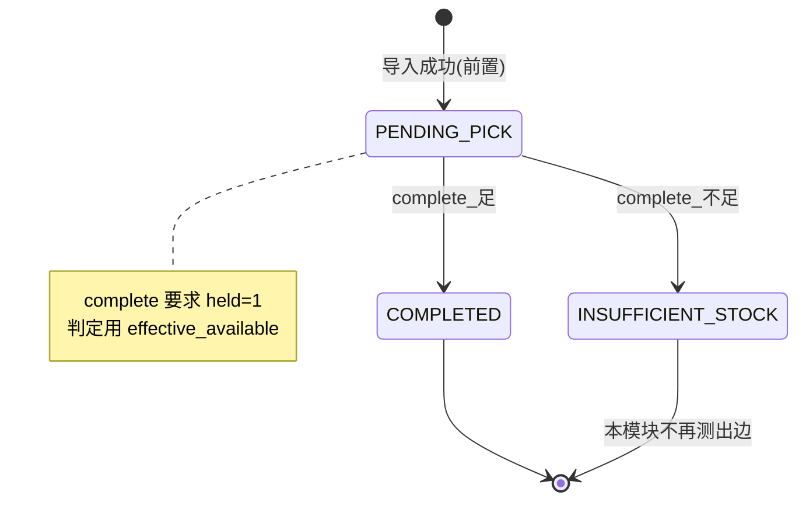

# 拣货完成 — 测试分析文档

| 属性 | 内容 |
|------|------|
| 模块 | 拣货完成（PickingComplete） |
| 接口 | `POST /api/v1/picking-tasks/{task_id}/complete` |
| 技术栈（已确认） | L1 场景 → L2 等价类+边界 → L3 决策表 → L5 工作流/状态 → L6 错误猜测（跳过 L4 正交） |
| 依据 | PRD v1.1；api-picking-inventory.md §0 / §2.4；order-picking-inventory-split-reviewed.md US-02 / US-03 |
| 状态 | 第 4 阶段完成 — 用例见 [拣货完成-测试用例表.md](./拣货完成-测试用例表.md)（23 条） |

---

## 1. 模块概述

**功能摘要：** 拣货员对处于 `PENDING_PICK` 且 `reservation_held=true` 的任务提交完成。系统按 SKU 聚合后用 **`effective_available ≥ demand`** 判定：

- **充足：** 任务/订单 → `COMPLETED`；`on_hand` 扣减、本任务 `reserved` 释放；写 `terminal_action_id`、流水 `DEDUCT`、job=`SKIPPED`、outbox。
- **任一 SKU 不足：** 整单不扣 `on_hand`；任务 → `INSUFFICIENT_STOCK`（订单仍 `PICKING`）；继续占预留；返回 `shortages`；动作结果=`SUCCESS` + `reason_code=INSUFFICIENT_STOCK`。

**核心业务目标：** 保证出库账实一致（禁止「已完成未扣减 / 已扣减未终态」），并用 `effective_available` 避免「已预留却被误判不足」。

---

## 2. 测试范围说明

### 范围内

1. 库存充足完成：状态、库存、流水、job、写序、终态字段
2. 库存不足进异常：不扣减、held 不变、缺口明细、HTTP 200 + reason_code
3. `effective_available` / `raw_available` 判定差异（完成路径必须用 effective；误用 raw 会导致假不足）
4. 多 SKU / 同行同 SKU 聚合后的全有或全无
5. `task_version` CAS 冲突；`reservation_held=0` 防御（`RESERVATION_NOT_HELD`）
6. 从非法任务状态发起 complete（终态 / 非 PENDING）
7. 并发完成至多一次扣减（作为错误猜测 / 场景前提点到）
8. 权限拒绝、幂等重放：仅作**相关前提/点到**，不展开完整横切矩阵

### 范围外

1. 订单导入细节（建单、预留、IMPORT_FAILED 重入）
2. retry / force-complete / cancel / reservation-timeout 全流程
3. 权限矩阵全角色组合、幂等全动作矩阵
4. 列表/详情 UI 或纯查询接口（除验证异常列表可见的最小点到，可选 P3）
5. 入库加库存、波次拣货、部分发运

---

## 3. 测试风险评估

| 子功能 / 关注点 | 风险 | 理由 |
|-----------------|------|------|
| 充足完成扣减 + 写序（CAS→余额→动作→流水） | 🔴 高 | 账实一致性核心；漏 CAS / 颠倒写序 → 双扣或半成功 |
| `effective_available` 判定（含 own_reserved） | 🔴 高 | 误用 `raw_available` 会把主路径判成不足；公式复杂 |
| 不足进异常：不扣减 + held 仍 true + shortages | 🔴 高 | 错扣库存或松预留会污染下游决策 |
| 多 SKU 全有或全无 / 按 sku 聚合 | 🔴 高 | 部分扣减是仓配高危缺陷 |
| `task_version` CAS / 状态冲突 | 🟡 中 | 并发与乐观锁；文档明确 409 |
| `reservation_held=0` 仍 complete | 🟡 中 | 本期防御码；正常 PENDING 不应 held=0，但需覆盖 |
| 非法状态再 complete | 🟡 中 | 终态不可再完成 |
| 请求字段校验（缺 action_id / 类型错误） | 🟢 低 | 通用 API 校验，非本域核心 |
| 权限 DENIED / 幂等重放（点到） | 🟡 中 | PRD S4/S5；本模块仅点到，完整矩阵另模块 |

**覆盖密度目标：**

| 风险 | 预期用例密度 |
|------|----------------|
| 🔴 高 | P1 ≥3，P2 ≥2（各高风险点合计满足） |
| 🟡 中 | P1 ≥2，P2 ≥1 |
| 🟢 低 | P1 ≥1，P3 可酌情 |

---

## 4. 覆盖目标

| 级别 | 目标 |
|------|------|
| P1 | 100% 覆盖本分析追溯矩阵中标记为 P1 的需求点 |
| P2 | ≥80% 覆盖 P2 需求点 |
| P3 | 酌情（边界类型错误、可选列表可见等） |
| 冒烟 | 仅第 1 层主成功路径，**最多 1–3 条**（本模块建议 2：足完成 + 不足进异常） |
| 测试层次 | 以 **API / DB / 逻辑** 为主（非 UI） |

---

## 5. 场景分析（第 1 层）

| # | 流程类型 | 场景 | 关键断言 |
|---|-----------|----------|----------|
| S-1 | 主成功 | `PENDING_PICK`+held，各 SKU `effective_available ≥ demand` → COMPLETED | on_hand↓、reserved↓、订单 COMPLETED、job SKIPPED、terminal_action_id、流水 DEDUCT |
| S-2 | 主成功（业务成功进异常） | 至少一 SKU `effective_available < demand` → INSUFFICIENT_STOCK | 不改 on_hand/reserved；held=true；shortages；动作 SUCCESS+INSUFFICIENT_STOCK；订单仍 PICKING；job 仍 PENDING |
| S-3 | 备选 | 多行同 SKU：聚合 demand 后判定并扣减 | 按 sku 聚合，非按行独立误判 |
| S-4 | 备选 | 多 SKU：全部充足 → 一次完成扣减全部 | 各 SKU 均 DEDUCT |
| S-5 | 异常 | 多 SKU：仅部分不足 → 整单不扣 | 无部分发运；shortages 含不足 SKU |
| S-6 | 异常 | version/状态冲突 → 409，不改库存 | TASK_VERSION_CONFLICT 或 INVALID_STATUS |
| S-7 | 异常（点到） | 无 `picking.complete` → 403 DENIED，状态不变 | 不展开全角色矩阵 |
| S-8 | 异常（点到） | 同 action_id 重放 → 返回首条，不二次扣减 | 不展开全幂等矩阵 |

**冒烟候选：** S-1、S-2（最多 2 条标记冒烟 ✓）。

---

## 6. 等价类与边界分析（第 2 层）

### 6.1 请求字段

| 字段 | 有效类 | 无效类 | 边界点 |
|-------|-------------|-------------------|-----------------|
| `task_id`（路径） | 存在的任务 ID | 不存在；非数字 | — |
| `action_id` | 非空唯一字符串（≤64） | 空/缺省；超长 | 1 字符；64；65（若实现校验） |
| `task_version` | 等于当前 `picking_task.version` | 小于当前；远大于当前；缺省；非整数 | `version`、`version-1`、`version+1` |

### 6.2 库存判定量（逻辑 / API）

令 `D = demand`（按 sku 聚合），`E = effective_available`，`R = raw_available`，`Own = own_reserved`（held=1 时通常 = D）。

| 字段 / 量 | 有效类 | 无效 / 风险类 | 边界点 |
|------------|-------------|----------------------|-----------------|
| `E` vs `D`（完成判定） | `E ≥ D` → 可完成 | `E < D` → 进异常 | `E = D`（恰足）；`E = D - ε`（恰不足）；`E = D + ε` |
| `R` vs `D`（对照） | 完成路径**禁止**仅用 R | `R < D` 但 `E ≥ D`（已预留）→ 必须仍判充足 | 典型：`R=0, Own=D, E=D` |
| 多 SKU 最短板 | 全部 `E_i ≥ D_i` | 存在任一 `E_j < D_j` | 仅一 SKU 恰不足、其余恰足 |
| `shortage_qty` | `D - available`（响应计算） | 负缺口不应出现 | available=0 → shortage=D |

> 说明：`locked` 参与 `raw/effective`；边界用例可构造 `locked>0` 使 `E` 恰等于/小于 D（P2）。

---

## 7. 决策表分析（第 3 层）

**条件：**

- C1: `status == PENDING_PICK`
- C2: `reservation_held == 1`
- C3: 所有 SKU（聚合后）`effective_available ≥ demand`
- C4: `task_version` 匹配当前 version

**动作：**

- A1: → COMPLETED + 扣减释预留 + 流水 + job SKIPPED
- A2: → INSUFFICIENT_STOCK + 不扣减 + shortages + held 不变
- A3: 409 冲突/非法（不改库存）
- A4: 409 `RESERVATION_NOT_HELD`（不改库存）

| 条件 / 动作 | R1 | R2 | R3 | R4 | R5 | R6 |
|--------------------|----|----|----|----|----|-----|
| C1 PENDING_PICK | Y | Y | Y | Y | N | Y |
| C2 held=1 | Y | Y | Y | N | — | Y |
| C3 effective 足 | Y | N | Y | Y | — | Y |
| C4 version 匹配 | Y | Y | N | Y | Y | Y |
| **A1 完成扣减** | ✓ | | | | | |
| **A2 进异常** | | ✓ | | | | |
| **A3 409 冲突/非法状态** | | | ✓ | | ✓ | |
| **A4 409 RESERVATION_NOT_HELD** | | | | ✓ | | |

> R6 预留列：多 SKU 部分不足已并入 R2（C3=N）。权限失败 / 幂等命中不在本表展开。

**坍缩说明：** 「终态再 complete」与「version 不匹配」均归 A3（不改库存）；held=0 单独 A4 以对齐 API `RESERVATION_NOT_HELD`。

---

## 8. 正交分析（第 4 层）

**跳过。** 本模块关键因子为强相关业务条件（状态 × held × 充足判定），已由决策表覆盖；无 3 个以上松散独立参数需 pairwise。

---

## 9. 状态迁移分析（第 5 层）

本模块 **complete 动作** 相关状态机（不含 retry/force/cancel/timeout 出边的充分测试，仅标出边界）：



| 类型 | 迁移 / 尝试 | 期望 |
|------|----------------------|----------|
| 合法 | PENDING_PICK → COMPLETED（足） | 终态 + 扣减 |
| 合法 | PENDING_PICK → INSUFFICIENT_STOCK（不足） | 异常态 + 不扣减 |
| 非法 | COMPLETED →（再 complete） | 409 INVALID_STATUS / 冲突；不改库存 |
| 非法 | INSUFFICIENT_STOCK →（用 complete 而非 retry） | 409 INVALID_STATUS；不改库存 |
| 非法 | FORCE_COMPLETED / CANCELLED → complete | 同上 |
| 非法 | 跳步：无 PENDING 任务直接 complete 不存在 ID | 404 NOT_FOUND |
| 边界 | 进入 COMPLETED 后：held=0、terminal_action_id 非空 | 不变量断言 |
| 边界 | 进入 INSUFFICIENT_STOCK 后：held 仍 true、订单=PICKING | 不变量断言 |

**覆盖规则：** PENDING_PICK 作为入口；COMPLETED / INSUFFICIENT_STOCK 作为本模块出口；终态再进为非法迁移用例。

---

## 10. 错误猜测分析（第 6 层）

按风险排序的缺陷易发点：

| # | 风险 | 缺陷猜测 | 建议验证 |
|---|------|----------|----------|
| EG-1 | 🔴 | 完成判定误用 `raw_available`，导致已预留任务被判不足 | 构造 `R < D` 且 `E ≥ D`，期望仍 COMPLETED |
| EG-2 | 🔴 | 先改库存再 CAS / 或先流水后动作 | DB 断言写序；失败路径无半成功 |
| EG-3 | 🔴 | 并发双 complete → 双扣 | 同任务并发；至多一次 on_hand 减少 |
| EG-4 | 🔴 | 多 SKU 部分不足时部分扣减 | 余额与流水均无变更 |
| EG-5 | 🟡 | CAS 失败后仍写流水 | 409 后库存/流水无新行 |
| EG-6 | 🟡 | 不足分支误写 terminal_action_id 或误 SKIPPED job | 不足后终态键仍空；job 仍 PENDING |
| EG-7 | 🟡 | 同 SKU 多行未聚合，锁序死锁或漏扣 | 多行同 sku 聚合 demand |
| EG-8 | 🟡 | 双提交 / 错序：complete 后再次 complete | 第二次冲突或幂等，不二次扣减 |
| EG-9 | 🟢 | `task_version` 类型错误、缺字段 | 4xx；业务不变 |
| EG-10 | 🟢 | 极端 action_id（超长、特殊字符） | 校验或安全存储，无 5xx 脏数据 |

---

## 11. 需求追溯矩阵（RTM）

> 第 4 阶段已回填用例编号。

| 需求编号 | 需求摘要 | 优先级提示 | 用例编号 | 覆盖状态 |
|----------------|---------------------|---------------|---------------|-----------------|
| S2 | 完成成功：on_hand↓、reserved 释放、任务/订单 COMPLETED | P1 | TC-001, TC-003, TC-004, TC-006, TC-008, TC-011, TC-020 | ✅ 已覆盖 |
| S3 | 完成不足：不扣 on_hand、INSUFFICIENT_STOCK、返回缺口 | P1 | TC-002, TC-005, TC-007, TC-009, TC-022, TC-023 | ✅ 已覆盖 |
| FR-03 | PENDING_PICK 完成；用 effective_available；乐观并发 | P1 | TC-001, TC-003, TC-004, TC-006, TC-008, TC-010, TC-013, TC-021 | ✅ 已覆盖 |
| FR-04 | 任一不足整单不扣；继续占预留；异常可见 | P1 | TC-002, TC-007, TC-014, TC-023 | ✅ 已覆盖 |
| API-0-EFF | 完成路径 `effective_available = raw + own_reserved` | P1 | TC-003, TC-004, TC-005, TC-009 | ✅ 已覆盖 |
| API-2.4-OK | 200 SUCCESS 完成：held=false、version+1 | P1 | TC-001 | ✅ 已覆盖 |
| API-2.4-SHORT | 200 SUCCESS + reason INSUFFICIENT_STOCK + shortages | P1 | TC-002, TC-005, TC-022, TC-023 | ✅ 已覆盖 |
| API-2.4-CAS | 先 CAS 终态再改余额；rows=0 → 409 不改库存 | P1 | TC-001, TC-010, TC-011, TC-012 | ✅ 已覆盖 |
| API-2.4-ORDER | 写序：CAS → 余额 → 动作 → 流水 → 订单/job/outbox | P1 | TC-001, TC-012 | ✅ 已覆盖 |
| API-2.4-HELD0 | held=0 → 409 RESERVATION_NOT_HELD | P2 | TC-016 | ✅ 已覆盖 |
| API-2.4-AGG | 按 sku_id 聚合 demand 后判定/加锁 | P1 | TC-006, TC-007, TC-008 | ✅ 已覆盖 |
| API-ERR-409 | TASK_VERSION_CONFLICT / INVALID_STATUS | P2 | TC-010, TC-013, TC-014, TC-015, TC-016 | ✅ 已覆盖 |
| API-ERR-404 | 任务不存在 NOT_FOUND | P3 | TC-017 | ✅ 已覆盖 |
| US-02-CONCUR | 并发/已迁出 PENDING → 失败且本方不改库存 | P1 | TC-010, TC-011 | ✅ 已覆盖 |
| US-02-PERM | 无权限 DENIED（点到） | P2 | TC-019 | ✅ 已覆盖 |
| US-02-IDEM | 同 action_id 重放不重复扣减（点到） | P2 | TC-020 | ✅ 已覆盖 |
| PRD-6.1-AON | 缺货全有或全无，禁止正常路径部分发运 | P1 | TC-007 | ✅ 已覆盖 |
| PRD-6.4-ATOMIC | 状态+库存+日志+流水同事务 | P1 | TC-001, TC-002, TC-011, TC-012 | ✅ 已覆盖 |
| INV-TERM | 终态 ⇒ terminal_action_id 非空且 reservation_held=0 | P1 | TC-001, TC-013, TC-023（反向） | ✅ 已覆盖 |
| INVENTORY_NOT_FOUND | 完成瞬间余额行缺失 → 422，不静默 upsert | P2 | TC-018 | ✅ 已覆盖 |

---

## 12. 技术栈提醒（已确认）

```
第 1 层 场景
第 2 层 等价类 + 边界
第 3 层 决策表
第 5 层 工作流 / 状态
第 6 层 错误猜测
—— 跳过 第 4 层 正交
```

---

## 13. 第 4 阶段交付说明

已生成 [拣货完成-测试用例表.md](./拣货完成-测试用例表.md)：合计 **23** 条（冒烟 **2**；P1 **13** / P2 **8** / P3 **2**）。同源断言已合并，单条可映射多个需求引用。
